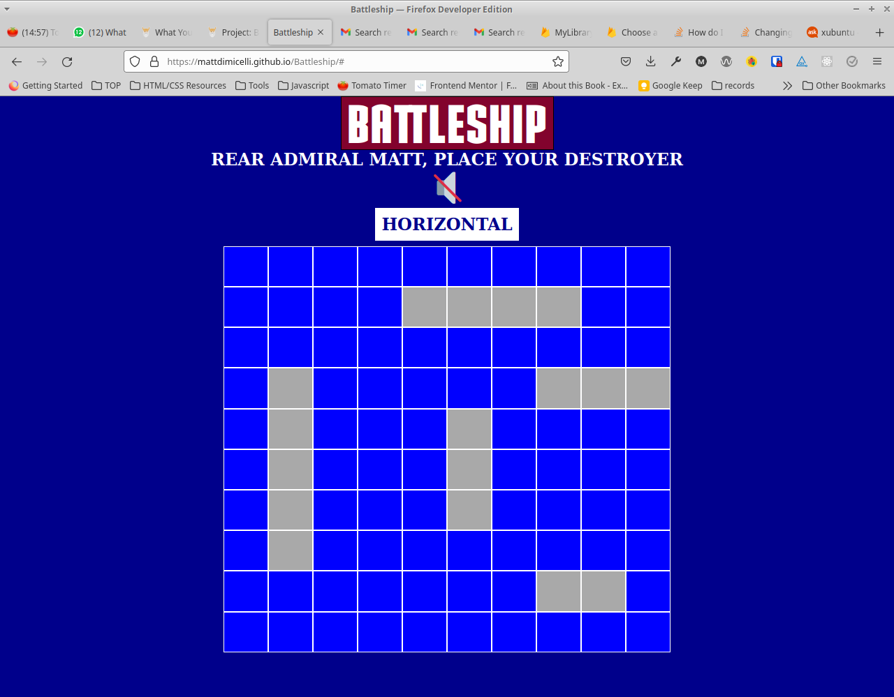

# Readme
# BATTLESHIP

## Overview

The classic Battleship game, built via Test Driven Development (TDD). Specifically, the game's logic was written separate from the DOM controller, and it was the former which was written with TDD.  

### Challenge

The design requirements from The Odin Project to make a Battleship app are detailed [here](https://www.theodinproject.com/paths/full-stack-javascript/courses/javascript/lessons/battleship)

### Screenshot

  

### Links

- [Live site](https://mattdimicelli.github.io/No_Framework_Battleship_Via_TDD/)
- [Repo](https://github.com/mattdimicelli/No_Framework_Battleship_Via_TDD)

## My process

### Built with

- It's all Vanilla... no frameworks, no pre-built components
- Test Driven Development (TDD) via Jest
- Webpack
- HTMLMediaElement API for sound effects and soundtrack

### What I learned

Since this project was the first one that I ever wrote with tests, as well as
TDD, I had to turn-around the way that I thought of how to code.  Besides the 
experience of having the tests guide my code, requirement-by-requirement (coding
just enough to make the test pass), I honestly believe that this was the first 
project where I truly contemplated the logic separately from the DOM, and that 
was a very eye-opening practice.  I really ended up enjoying the experience.  
Doing this project made me realize that I still had to learn a lot about testing,
for example how to better do mocks and how to test the DOM.  It inspired me to 
go outside of The Odin Project's curriculum and further explore testing, which I
plan to do shortly, as I have bought a course on testing.  

Besides the testing, there is so much more that I learned in this project. 
It was one of the first apps that I made utilizing JS classes and ES6 modules, 
and I had to figure out how to structure the application.  For example, 
how many files to have, what code to put in each one, and how to connect the 
different files together.  Another challenge that I surmounted was keeping all 
of the logic (ex. variables) encapsulated in the class definition.  Tightly-coupled 
dependencies initially caused me to get errors upon bundling my 
app with Webpack; I had circular dependencies.  These errors made me aware of 
the complexity of programming with modules, and led me to further research several 
different module systems, not just the ES6 modules which are used in this app.
Besides learning about the surpising complexity of ES6 modules, I explored the
history of and the reasoning behind the CommonJS module system.  I also struggled
with, and as a result, learned how to use the "this" keyword (with bindings,
arrow functions, etc).... Alternatively, I learned that often the complexity 
that the "this" keyword brings to the table can be circumvented by avoiding 
the keyword.

Although it's far from perfect, I learned a lot from this project.  Further 
enhancements could be upping the AI, as well as improving support for smaller
devices.
